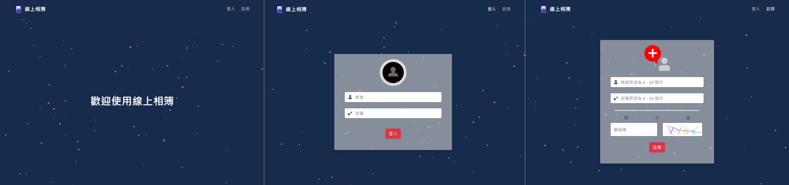
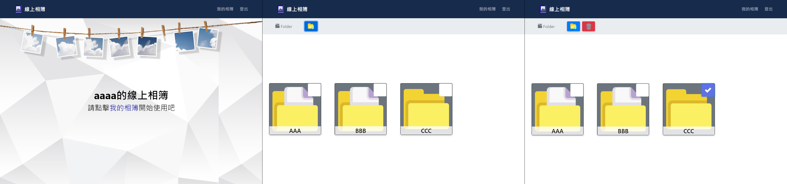
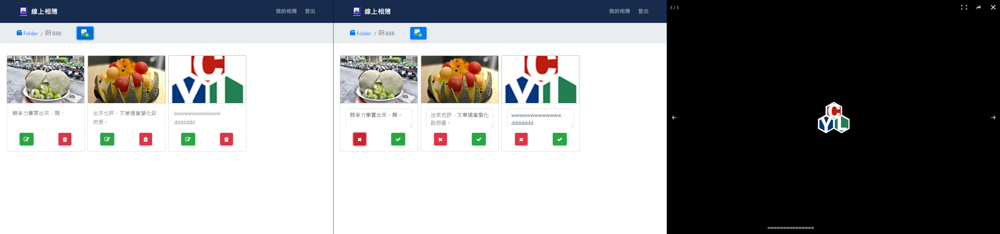

# 線上相簿 Online Photo Album 
### 登入前功能
#### 1. 使用者登入
#### 2. 註冊
- 密碼強度判斷
- 驗證碼驗證

### 登入後功能
#### 1. 資料夾新增 ( 最多 5 個 )
#### 2. 資料夾刪除 ( 勾選後會出現刪除按鈕 )

#### 3. 新增
- 相片 ( 最多 5 張且大小限制為1MB )
- 相片說明 ( 30字以內，可不填寫 )
#### 4. 相片說明文字修改
#### 5. 相片刪除
#### 6. 點擊相片會放大並於下方顯示說明文字
#### 7. 使用者登出

## Demo
https://laura-chou.github.io/vue_photo/